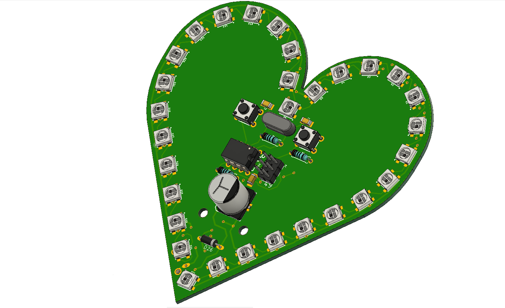
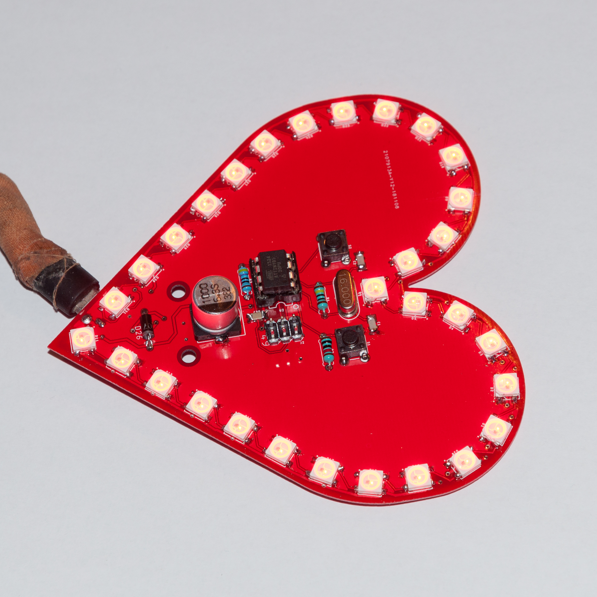

# ws2812-leds-on-a-heart-shaped-pcb

### About the project
This is a WS2812 LED driver circuit with an ATTiny85 MCU. PCB and the LEDs are aligned to create a heart shape because it's a gift.  Unfortunately, I'm quite sort of time so the code is very basic and it has been created from the examples found on Adafruit's website. In the future I'll upload a newer version. This version is only capable for 4 basic effects witch can be selected with the left function button.

### Contents
* Gerber files (the version that I've sent to the fab house)
* Updated board layout and schematics
* 3D model can be found on my fusion360 gallery
* Code (Arduino sketch and hex)
* Datasheet
* Images of the result

### The following steps are required to deploy the provided .hex, or the Arduino sketch:
* Here is how to program ATTiny MCUs in Arduino IDE: [link](http://highlowtech.org/?p=1695)
* I've used external 16 MHz oscillator (AVR fuse settings needed + hex is compiled this way too) so it might be required but I assume it works on internal clock well too but code should be recompiled
* Code is based on Adafruit's [Neopixel libary and their example projects](https://learn.adafruit.com/adafruit-arduino-lesson-16-stepper-motors/breadboard-layout) so Adafruit's libary might be needed if you want to deploy it from the IDE.
* Finnaly the hex should be uploaded. You can do this by using IDE-s "Upload using programmer" option or .hex file can be uploaded throuh AVR Dude too. It's basically your choice...

### ToDo

* 3D printed mounting for the two mounting holes
* Replace the full bascic code
